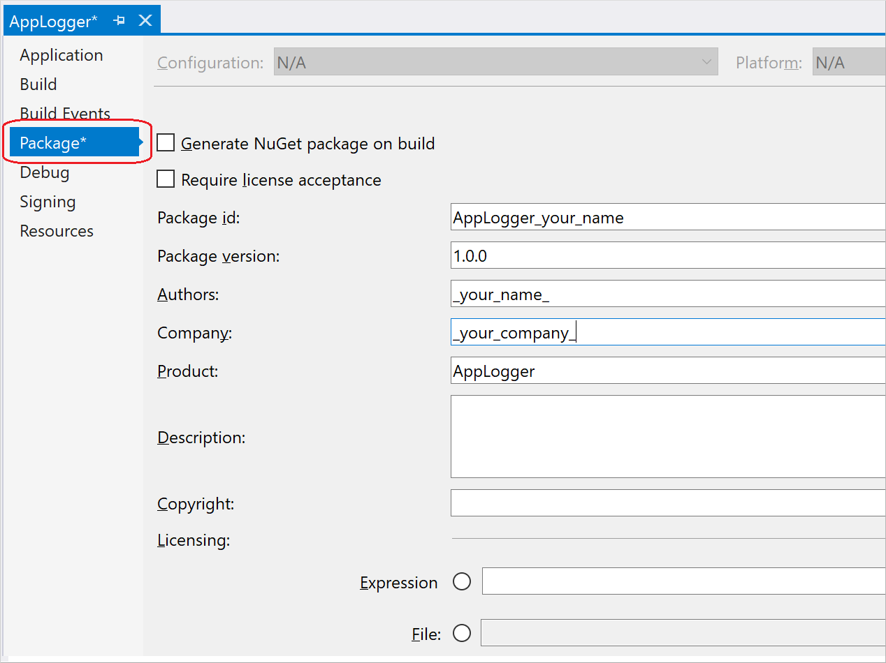
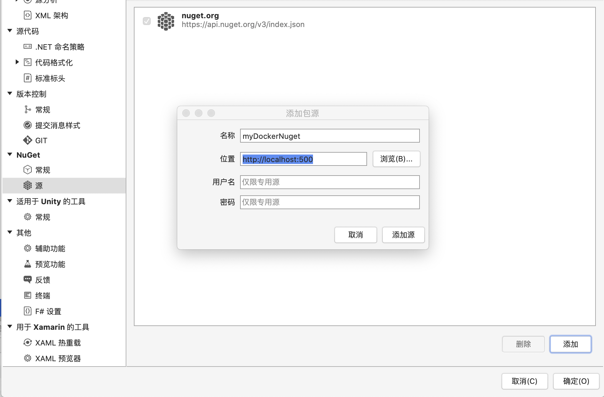

# 使用Docker在本地运行Nuget Server

Nuget作为包管理器，为dotnet生态提供了很好的代码分享平台。如果你想在你的组织分享package，或者你想在你自己的项目中共享package，那么在本地运行一个nuget server就是很好的选择。本文将介绍如何使用docker在本地运行一个nuget server，然后向server发布包，最后在visual studio中使用包。

## 使用docker运行nuget server

有了docker，一切都变得简单。在命令行中依次执行以下命令即可

```bash
# pull image
docker pull sunside/simple-nuget-server

# run image
docker run --detach=true --publish 5000:80 --env NUGET_API_KEY=123456 --restart=always --volume D:/nuget/database:/var/www/db --volume D:/nuget/packages:/var/www/packagefiles --name nuget-server sunside/simple-nuget-server
```

注意，在docker run命令中，NUGET_API_KEY是后续发布包所需的令牌。

## 发布包到nuget server

发布的过程分两步：

**首先，把类库打包**

1. 在vs中，右键单击项目，选择**Properties**菜单命令, 然后选择**Package**选项卡，设置package信息。其中，id需要唯一。
   

2. 信息设置好后，右键单击项目，选择**Pack**菜单命令，进行打包。打包后的结果，包括包的存储位置在vs的output中有显示。注意，nuget包文件的后缀是`.nupkg`.

**用命令把包发布到nuget server**

在命令行运行如下命令：

```bash
dotnet nuget push myClassLibName.1.0.0.nupkg --api-key 123456 --source http://localhost:5000
```

其中，api key即是创建docker container时传入的令牌，source是server的url。这样包就发布到了nuget server。

## 使用本地server的package

在项目中打开Nuget包管理器，进入设置界面，如下点击添加并编辑下面的【名称】和【位置】，完成之后确认即可。


这样，下次添加依赖时，切换到新添加的源，就可以看到本地server上的包了。

## 总结

因此，要在本地跑nuget server是很简单的：
1. 用docker很方便的跑一个server
2. 创建package并推到本地server
3. 然后在vs中添加nuget源，就可以畅快使用了。